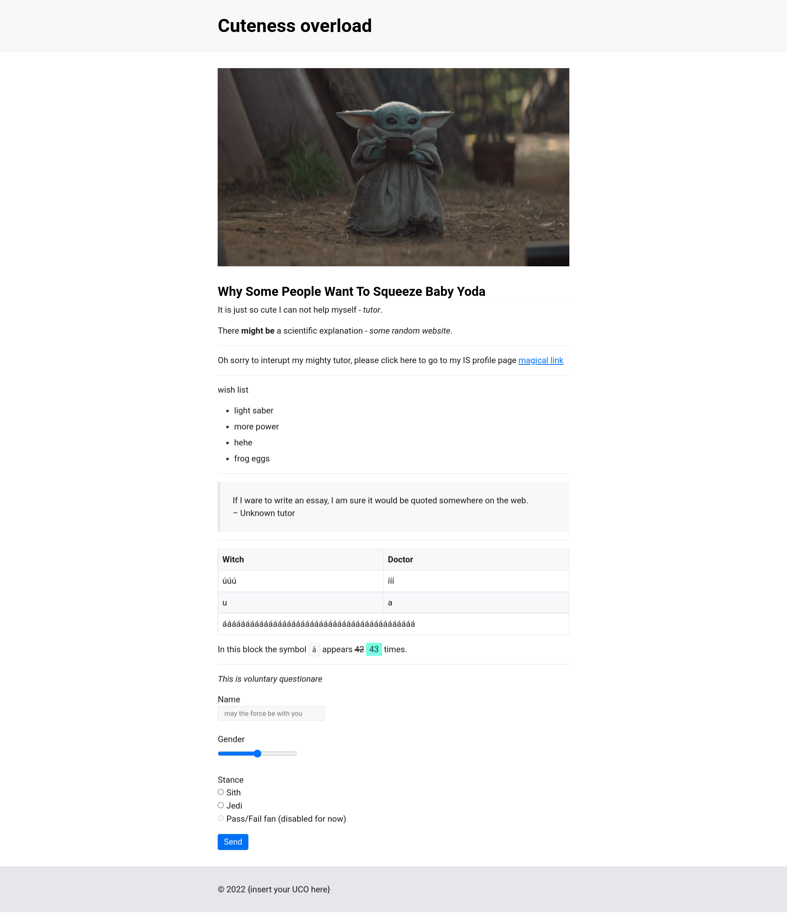

Use your knowledge of html tags and with the help of demo (which use the same stylesheet) fill the html document `yoda.html` so the page looks identical to `result.png`.  
  
Do not add or edit any styles.  